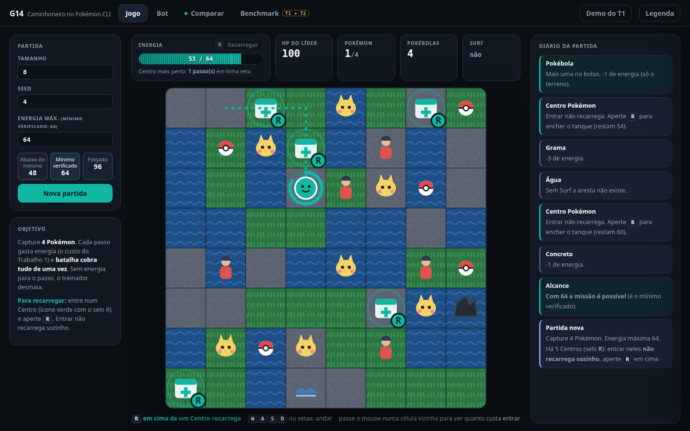
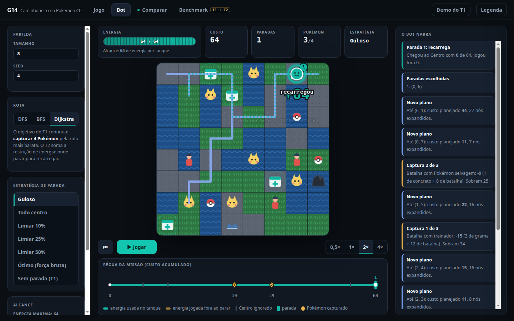
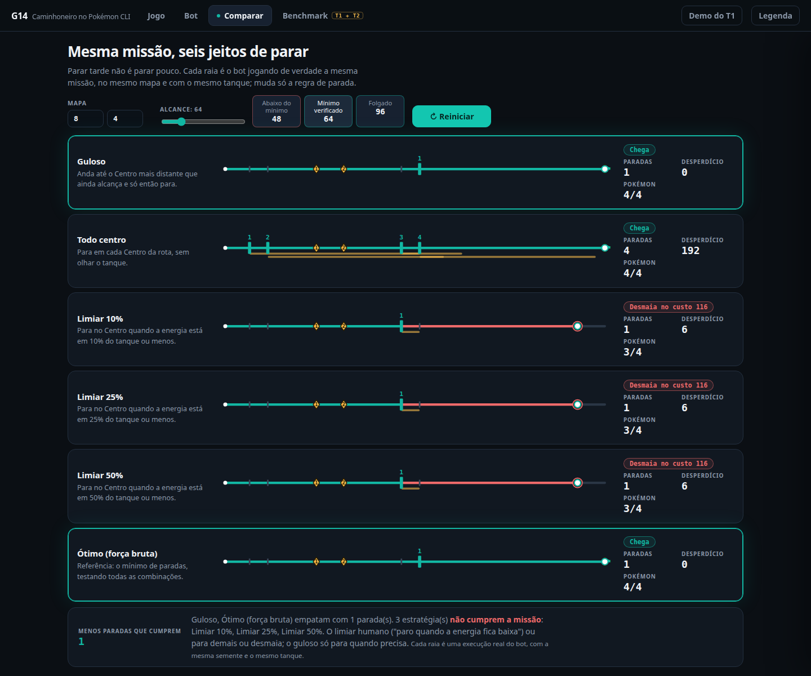
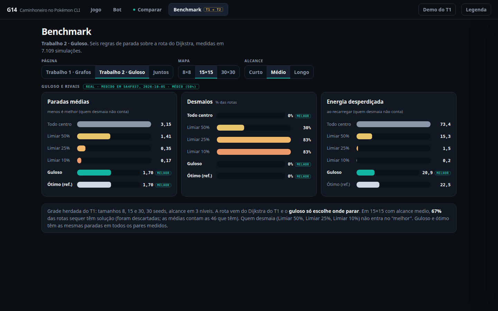

# Pokémon CLI: o Caminhoneiro

Projeto de Algoritmos (FGA0124) | Grupo 14 | Módulo 2: Algoritmos Ambiciosos (Greedy)

| Matrícula | Aluno |
| --- | --- |
| 190091681 | Lucas Gabriel Antunes |
| 202045965 | Augusto Campos Duarte |

## Apresentação

Vídeo de apresentação: [GP 14 - PA - greedy - 2026-2](https://youtu.be/-URT1e8Rkzg)

Relatório final: [`docs/relatorio-trabalho-2.md`](docs/relatorio-trabalho-2.md).

## Sobre

Continuação do [Trabalho 1](https://github.com/projeto-de-algoritmos-2026/G14_Grafos_PA-26.2),
em que o Dijkstra traçava a rota mais barata num jogo de Pokémon de terminal.
Agora o treinador tem **energia limitada** e o mapa ganha **Centros Pokémon**,
onde ela recarrega. Cada passo gasta de energia exatamente o peso que o grafo
do Trabalho 1 dá para a aresta.

O algoritmo do **caminhoneiro** (o problema clássico do posto de gasolina)
decide em quais centros parar ao longo da rota para chegar ao destino com o
**mínimo de paradas**. São duas otimizações empilhadas: o Dijkstra minimiza a
energia total da rota, e o guloso minimiza o número de paradas sobre ela.

A tese é que **parar tarde não é parar pouco**: a regra intuitiva de parar
quando a energia fica baixa ou para demais ou desmaia no meio do caminho, e o
guloso, que só para no centro mais distante que ainda alcança, é ótimo no
número de paradas sobre uma rota fixa. Isso é provado abaixo e medido em
7.109 simulações; o que acontece no jogo com batalha aleatória, onde o HP
muda o custo no meio do caminho, está em [Jogo real](#jogo-real-com-batalha-aleatória).

## Como executar

```bash
python -m venv .venv && source .venv/bin/activate
pip install -r requirements.txt
python -m pytest                  # testes
python -m webdemo                 # interface web (abre o navegador)
```

A interface sobe em `http://127.0.0.1:<porta>/`. Use `--porta N` para escolher
a porta e `--sem-navegador` para não abrir o navegador. A demo do Trabalho 1
continua em `/t1`.

### Terminal

```bash
python main.py --bot --size 8 --seed 4 --energia 64 --estrategia guloso
```

O jogo pergunta cinco coisas antes de começar (nome, gênero, natureza, inicial
`P`, `C` ou `S` e o nome do Pokémon). `--energia` liga a regra de energia e
`--estrategia` escolhe onde o bot para: `guloso`, `todo_centro`, `limiar_10`,
`limiar_25`, `limiar_50` ou `otimo`. Sem `--energia`, o jogo é o do Trabalho 1.
Com `--human` quem joga é você, e a tecla `R` recarrega em cima de um Centro.

**O terminal não é reprodutível:** o `main.py` semeia o mapa com `--seed`, mas não o
sorteio das batalhas, então o mesmo comando dá resultados diferentes a cada
execução (a interface web trava o sorteio por partida e sempre repete). Um
exemplo de uma execução no mapa 8x8 de seed 4 com tanque 64:

| Estratégia | Paradas | Energia desperdiçada | Resultado |
| --- | --- | --- | --- |
| `guloso` | 1 | 2 | quatro Pokémon capturados |
| `todo_centro` | 4 | 192 | quatro Pokémon capturados |
| `limiar_25` | 1 | 6 | desmaiou (`sem energia`) |

Em outras execuções o guloso terminou em `rota sem recarga possível` e o
`limiar_25` chegou. Para um resultado fixo, use a aba Comparar da interface.

### Benchmark

```bash
python -m bench                   # rotas, partidas, paradas e gráficos
python -m bench --so paradas      # só o experimento de paradas
python -m webdemo.snapshot        # regenera webdemo/dados/benchmark.json
python -m bench.jogo_real         # estratégias no jogo real, com batalha (~75 s)
```

Os CSVs e os gráficos ficam em `bench/out/`, que está versionado: rodar o
benchmark **sobrescreve** os resultados commitados (use `--saida DIR` para
gravar em outro lugar). A aba Benchmark da interface lê o snapshot JSON, que
guarda o commit e a data em que foi gerado.

## A interface

Quatro telas, em módulos ES nativos e mapa em SVG, sem build e sem dependência
nova. Nenhuma regra do jogo mora no navegador: custo, desmaio, recarga e
viabilidade do tanque chegam prontos do servidor.

**Jogo.** Você anda pelo mapa com `WASD` ou as setas. O medidor mostra a energia
e o que foi gasto, cada célula vizinha mostra quanto custa entrar e o diário
explica a conta (`-3 de grama`, `-9 = 1 de concreto + 8 de batalha`). Entrar
num Centro não recarrega: é preciso apertar `R` em cima dele.



**Bot.** O bot joga a partida e narra cada decisão. Escolha a rota (DFS, BFS ou
Dijkstra) e a estratégia de parada. A régua embaixo mostra o custo acumulado,
as paradas e os Pokémon capturados.



**Comparar.** Seis raias com o mesmo mapa, a mesma semente e o mesmo tanque.
Cada raia é o bot de verdade jogando uma estratégia, e não uma rota planejada:
só muda a regra de parada. No mapa padrão (8x8, seed 4, tanque 64) o guloso e o
ótimo chegam com 1 parada, o `todo_centro` chega com 4, e os três limiares
desmaiam no custo 116.



**Benchmark.** Os resultados medidos, em três páginas (Trabalho 1, Trabalho 2
e os dois juntos), com a origem de cada número no rodapé.



## Resultados

O experimento roda as seis regras de parada sobre as rotas do Trabalho 1 (DFS,
BFS e Dijkstra), no mesmo grid: mapas 8x8, 15x15 e 30x30, 30 seeds cada, vários
destinos por mapa e alcance curto, médio e longo. São **7.109 simulações**,
guardadas em `bench/out/paradas.csv`. Rotas sem recarga possível são descartadas
e registradas em `bench/out/paradas_descartes.csv` (3.983 descartes), por isso
só parte das seeds aparece nas simulações: 23 no 8x8, 18 no 15x15 e 21 no 30x30.

Em 15x15 com alcance médio (as 46 rotas que têm solução):

| Estratégia | Paradas (média) | Desmaios | Energia desperdiçada |
| --- | --- | --- | --- |
| **Guloso** | **1,70** | **0%** | 20,9 |
| Ótimo (força bruta) | 1,70 | 0% | 22,5 |
| Todo centro | 3,15 | 0% | 73,4 |
| Limiar 50% | 1,41 | 30% | 15,3 |
| Limiar 25% | 0,35 | 83% | 1,5 |
| Limiar 10% | 0,17 | 83% | 0,2 |

Estes números são do **modelo de custos fixos**: a simulação anda sobre os custos
planejados da rota, sem batalha no meio. Os limiares parecem baratos porque **quem desmaia não conta** parada nenhuma: a
média é de quem parou e seguiu. Somando os 9 cenários (3 tamanhos x 3 alcances)
sobre a rota do Dijkstra, cada estratégia roda em 557 rotas com solução, e o
limiar de 10% desmaia em 70% delas, o de 25% em 48% e o de 50% em 20%. O guloso,
o ótimo e o `todo_centro` não desmaiam em nenhuma.

- **Guloso contra ótimo:** em 1.179 pares (mesmo mapa, destino, alcance e
  algoritmo), o guloso parou **exatamente** o mesmo número de vezes que a força
  bruta, em todos. A comparação é feita par a par porque o ótimo é exponencial
  (2^k) e só roda até 20 centros na rota: ele ficou sem resultado em 7 das 1.186
  rotas, então as médias dos dois saem de conjuntos de rotas um pouco diferentes.
- **Guloso contra `todo_centro`:** mesmas chegadas, bem menos paradas.
- **Desperdício:** o guloso desperdiça menos energia que o ótimo (20,9 contra
  22,5). Não é contradição: o ótimo só garante o número mínimo de paradas, e
  entre as combinações com esse número a força bruta devolve a primeira que
  encontra (`otimas[0]`), sem olhar o desperdício. A diferença entre as médias
  também pode vir dessas 7 rotas que o ótimo não cobre.
- **Rotas inviáveis:** em 15x15 com alcance médio, 67% das rotas não têm
  solução (algum trecho entre centros passa do tanque) e ficam fora das médias.
  A quantidade descartada de cada cenário está em `bench/out/paradas_descartes.csv`.

### Jogo real (com batalha aleatória)

No jogo, a batalha tira HP e o HP encarece a grama, então o custo real de um
trecho pode passar do planejado. `python -m bench.jogo_real` roda o bot de
verdade em 15 mapas que ele vence (8x8 e 15x15), com o tanque em 1,5 vez o
mínimo verificado de cada mapa e 20 sorteios de batalha por mapa e estratégia
(300 partidas cada; o mapa é o mesmo, só as batalhas mudam):

| Estratégia | Chega | Desmaia (`sem energia`) | Bot não sai (`rota sem recarga possível`) | Sem Pokémon |
| --- | --- | --- | --- | --- |
| Guloso | 230 (77%) | 0 | 43 | 27 |
| Todo centro | 257 (86%) | 19 | 0 | 24 |
| Limiar 50% | 254 (85%) | 19 | 0 | 27 |
| Limiar 25% | 231 (77%) | 42 | 0 | 27 |
| Limiar 10% | 227 (76%) | 46 | 0 | 27 |

O guloso não desmaiou em nenhuma das 300 partidas, mas em 14% delas o plano não
achou recarga viável e o bot parou antes de andar, por isso chega menos que o
`todo_centro`. **Vale "o guloso nunca desmaia", não vale "o guloso sempre
chega".** A causa provável é o HP ter caído e encarecido a grama acima do tanque
restante, mas não foi isolada. No mapa padrão da interface (8x8, seed 4, tanque
64), só 4 de 40 sorteios de batalha terminam em vitória, para qualquer uma das
seis estratégias: o caso que mostra a tese é um sorteio favorável.

### Limites


- Em 25 das 36 combinações de mapa e tanque que medimos as estratégias empatam.
  A tese só aparece onde o tanque aperta; o mapa padrão da interface (8x8,
  seed 4, tanque 64) foi escolhido por mostrar exatamente isso.
- A vitória **não é monótona** no tanque. No 8x8 de seed 3 a busca binária
  acha 122, mas o tanque 46 já vence. Por isso a interface chama o número de
  "mínimo verificado": é o menor que a busca achou, não uma garantia de que
  nenhum menor funcione.
- O ótimo por força bruta é exponencial no número de centros (2^k) e só é
  rodado até 20 centros.

## Modelagem

- **Energia não é HP.** O HP cai em batalha aleatória e já muda o custo da
  grama. O caminhoneiro só é ótimo quando o consumo de cada trecho é conhecido
  antes de sair, então a energia é um atributo próprio do `Player`.
- **Consumo é o peso do Trabalho 1.** Entrar numa célula gasta
  `custo_entrada(celula, estado)`, calculado com o estado de antes do passo,
  incluindo a penalidade de batalha. É o mesmo número que o Dijkstra usou para
  planejar. Cada `Movimento` guarda as duas parcelas (`custo_terreno` e
  `custo_conteudo`), para a interface explicar a conta sem recalculá-la.
- **Centro é prédio, não item.** Não some quando pisado e passar por ele não
  recarrega sozinho: recarregar é uma ação separada (`game.recarregar`), porque
  passar sem parar é justamente a escolha do guloso.
- **Sem energia para o próximo passo, o treinador desmaia** onde está e a
  partida acaba com o motivo `sem energia`, que conta como derrota.
- **Os mapas do Trabalho 1 não mudaram.** Os centros são sorteados depois do
  mapa inteiro, só em células livres fora da água e da origem. Em 90 mapas
  (8, 15 e 30, 30 seeds cada) nenhuma célula mudou além das que viraram
  centro, e nenhuma distância do Dijkstra mudou. Os centros ocupam 8% do mapa.
- **Energia `None` desliga a regra**, e o jogo, o bot e o benchmark do
  Trabalho 1 funcionam como antes.

## O algoritmo

O caminhoneiro é uma função pura em `greedy/caminhoneiro.py`, separada do mapa e
do jogo para poder ser testada com listas de números.

- **`marcos_da_rota(caminho, mapa, estado)`** reduz a rota que o Dijkstra
  devolveu a uma lista de marcos `(custo_acumulado, é_centro)`. A origem entra
  com custo zero (o tanque começa cheio) e o custo acumulado do último marco é,
  por construção, o custo total que o Dijkstra calculou.
- **`paradas(marcos, alcance)`** decide onde parar. A partir do ponto onde o
  tanque encheu, anda até o **centro mais distante ainda dentro do alcance** e
  para nele; repete até o destino caber no tanque. Retorna os índices dos
  centros escolhidos: lista vazia quando a rota inteira cabe num tanque (zero
  paradas) e `None` quando algum trecho entre pontos de recarga passa do
  alcance (rota inviável).
- **`alcance` é o tamanho do tanque** e recarregar num centro enche de novo. É
  linear no tamanho da rota, porque os marcos já vêm ordenados por ela.

### Por que o guloso é ótimo

Argumento *greedy stays ahead*. Sejam `g1 < g2 < ...` as paradas do guloso e
`o1 < o2 < ...` as de qualquer solução viável, medidas pelo custo acumulado.

1. `o1` está dentro do alcance a partir da origem, e `g1` é o centro mais
   distante dentro desse alcance. Logo `g1 >= o1`.
2. Se `gk >= ok`, então `o(k+1)` está dentro do alcance a partir de `ok`, e
   portanto a partir de `gk`, que está mais à frente. O guloso escolhe o centro
   mais distante alcançável a partir de `gk`, então `g(k+1) >= o(k+1)`.
3. Se uma solução chega ao destino com `m` paradas, o destino está dentro do
   alcance a partir de `om`, logo a partir de `gm >= om`. O guloso chega com no
   máximo `m` paradas.

Esse invariante, a `k`-ésima parada do guloso nunca fica atrás da `k`-ésima de
nenhuma solução ótima, é conferido nos testes contra a força bruta
(`tests/test_caminhoneiro_otimalidade.py`, 400 rotas sorteadas, até 15 centros).
A força bruta (`greedy/forca_bruta.py`) testa todos os subconjuntos de centros e
não assume nada sobre a estrutura do problema, então concordar com ela é
evidência independente.

## Estrutura

| Pasta | Conteúdo |
| --- | --- |
| `greedy/` | caminhoneiro, estratégias rivais, força bruta, simulação e viabilidade do tanque |
| `graph/` | grafo, custos e busca do Trabalho 1 |
| `bot/` | o bot que planeja e executa a rota, com ganchos para a interface |
| `bench/` | benchmark do Trabalho 1 e o experimento de paradas; saída em `bench/out/` |
| `webdemo/` | servidor, API (`/api/t2/*`), snapshot do benchmark e a interface em `static/` |
| `tests/` | 3.376 testes |
| `docs/` | relatório, plano, contrato de leitura do benchmark e os documentos do Trabalho 1 |

## Divisão do trabalho

| Fase | Conteúdo | Quem |
| --- | --- | --- |
| 0 a 2 | Repositório, energia e Centro Pokémon, algoritmo do caminhoneiro | Lucas |
| 3 | Testes e prova de otimalidade (força bruta e invariante) | Augusto |
| 4 | Estratégias rivais e bot com estratégia | Augusto |
| 5 | Experimento de paradas e gráficos | Augusto |
| 6 | Interface | Lucas |
| 7 | README, relatório e vídeo | a definir |

O plano completo, em fases, está em [`docs/plano-trabalho-2.html`](docs/plano-trabalho-2.html).

## Trabalho 1

O README e o relatório do Trabalho 1 foram preservados em
[`docs/README-trabalho-1.md`](docs/README-trabalho-1.md) e
[`docs/relatorio-trabalho-1.md`](docs/relatorio-trabalho-1.md).

## Referência

Este projeto parte do jogo original criado por
[elchic00](https://github.com/elchic00/pokemon), adaptado pelos alunos para a
disciplina.
